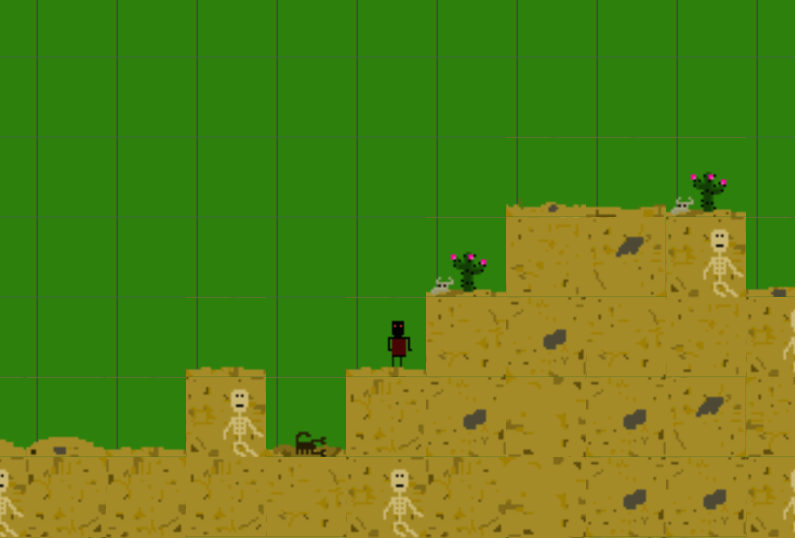
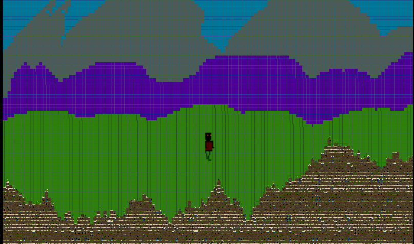
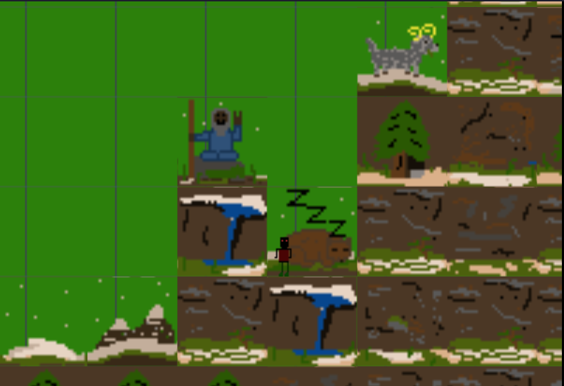

<p align="center">
  
  Runn the World is an infinite sidescroller with procedurally-generated levels written in TypeScript. The player can grow the sprite to jump over mountains or shrink them down to enjoy our original pixel art close-up!
</p>

&nbsp;&nbsp;&nbsp;&nbsp;&nbsp;&nbsp;&nbsp;&nbsp;&nbsp;&nbsp;&nbsp;&nbsp;&nbsp;&nbsp;&nbsp;&nbsp;&nbsp;


<div align="center">
  <sub>Made through collaboration between <a href="https://github.com/EricBot89">Eric Loucks</a> and <a href="https://github.com/FakeBarenziah">Nick Balestrieri.</a></br>Original boilerplate made with ❤︎ by <a href="https://github.com/digitsensitive/phaser3-typescript/">digitsensitive</a></br>
  Framework created by <a href="https://github.com/photonstorm">Photonstorm</a></sub>
</div>

# Phaser 3 and TypeScript

[Phaser](https://github.com/photonstorm/phaser) is a wonderful, fast and
free open source HTML5 game framework.
It's used here with Typescript to enhance maintainability and understandability.

## Getting started

### Prerequisites

```
Download and install npm with Node.js @ https://nodejs.org/en
```

### Installing

Select a folder, navigate to it, and clone this repository
with this command-line:

```
git clone https://github.com/FakeBarenziah/runtheworld.git
```

Install the dependencies with this command-line:

```
npm install
```

### Building and Running

Perform a quick build (bundle.js) and start server:

```
npm run dev
```

## Game Screenshots

<p float="left">
  
  
</p>
<p float="left">

  
</p>

## Adding New Terrains

Terrains currently follow a convention of 27 tiles per set and 32x32 pixels per tile. The first 9 tiles are assigned collision properties and represent "underground," or visually below the level the player stands on, and tiles 10-27 are placed on the "surface" level and not assigned collision.

To add new tilesets, place the .png file into /src/boilerplate/assets, and then add the path in a load statement below line 52 of /src/boilerplate/scenes/mainScene.ts in the same way that the other sets are given. Then add the corresponding key into the array on line 45 of that file.

## Cheat Sheets

- [Browse through the Cheat Sheets](https://github.com/digitsensitive/phaser3-typescript/blob/master/cheatsheets)

## Tutorials

- [Learn to create a HTML5 Game in 5 Minutes](https://medium.com/@digit.sensitivee/learn-to-create-a-html5-game-in-5-minutes-604118f5d0ab)

## External Resources

- [Phaser 3 Framework](https://github.com/photonstorm/phaser)
- [Phaser 3 Docs with TypeScript Definition File](https://github.com/photonstorm/phaser3-docs)
- [Phaser 3 Online Docs](https://photonstorm.github.io/phaser3-docs/index.html)
- [Phaser 3 Official Examples](https://github.com/photonstorm/phaser3-examples)
- [Phaser 3 Discourse](https://phaser.discourse.group)

## Helpful tools

- [Leshy SpriteSheet Tool](https://www.leshylabs.com/apps/sstool)
- [Tiled](https://www.mapeditor.org)
- [Littera](http://kvazars.com/littera)
- [Tile Extruder](https://github.com/sporadic-labs/tile-extruder)

## TypeScript Configuration

### tsconfig.json

The following `Compiler Options` have been set in the `tsconfig.json` file:

| Option | Value     |
| :------------- | :------------- |
| target       | ES2016 |
| module       | CommonJS |
| sourceMap    | true |
| noImplicitAny| true [WIP] |
| strict       | true [WIP] |

You can see the complete list of the available options at [here](https://www.typescriptlang.org/docs/handbook/tsconfig-json.html).
Interesting read about [setting up a nodejs-project](https://codeburst.io/tips-for-setting-up-a-typescript-nodejs-project-5d1c48dc1a2d).

## Contributing

Want to correct a bug, contribute some code, or improve the codes? Excellent! Let me know!
Please read [CONTRIBUTING.md](https://github.com/digitsensitive/phaser3-typescript/blob/master/CONTRIBUTING.md) for details on our code of conduct.

## License

This project is licensed under the MIT License - see the [LICENSE.md](https://github.com/digitsensitive/phaser3-typescript/blob/master/LICENSE) file for details.
